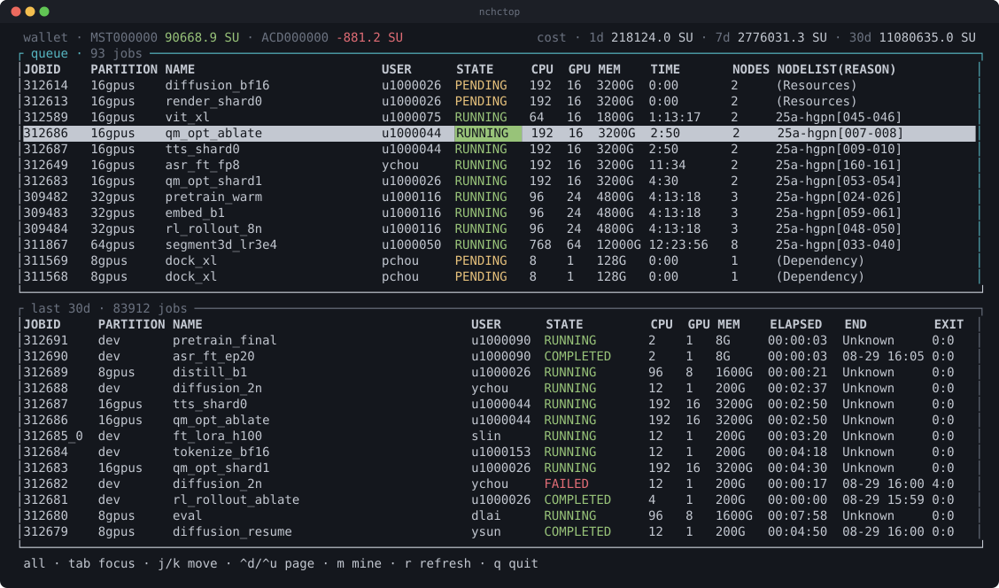

# nchctop

A top-like terminal view of Slurm jobs, built for NCHC clusters.

## Install

    curl -LsSf https://raw.githubusercontent.com/tanchihpin0517/nchctop/main/install.sh | sh

That drops a statically linked binary in `~/.local/bin`, so a login node with no
Rust toolchain and an old glibc still runs it. The script checks the published
sha256, and says so if `~/.local/bin` is not on your `PATH`.

Somewhere else, or an older release — note the `-s --`, which is how a piped
script is given arguments:

    curl -LsSf https://raw.githubusercontent.com/tanchihpin0517/nchctop/main/install.sh | sh -s -- --dir ~/bin --version 0.1.0

`NCHCTOP_INSTALL_DIR` and `NCHCTOP_VERSION` do the same, and `--help` lists
everything.

nchctop keeps itself current: each start runs that same script in the
background, against the directory the running binary is in. The script is built
into the binary rather than fetched, so an update runs only code that shipped
with it, and it asks which release is latest — the tag `/releases/latest`
redirects to — before deciding to download one, so the usual start costs a
header rather than a binary. The screen opens straight away and the session carries on as the
version it started as; when a newer release lands, the footer says so and the
next start picks it up. Failures — an offline node, a directory you cannot
write — are a note in the footer and nothing more. `nchctop --no-update` skips
the check.

To update on demand, without opening the screen:

    nchctop update

That runs the same script in the foreground, so you see what it did and get a
non-zero exit if it could not. `nchctop update --force` installs the release
even when it is the one already here, which is the way past a binary that is
somehow ahead of the latest release, or too broken to say what version it is. Running the `curl` line again does the same from
outside. Either way it replaces the binary in place, reports the version it
moved from, and stops without downloading twice when you already have the
release it would install; `--force` reinstalls anyway.

Or, from source:

    cargo install --git https://github.com/tanchihpin0517/nchctop

## Refresh

Everything on screen is fed by its own background thread, so a slow cluster
never blocks the interface. Press `r` to refresh the wallet and both panes at
once; the log window follows on its own.

| Pane | Command | Interval |
| --- | --- | --- |
| queue | `squeue` | 1s |
| last 30d | `sacct`, jobs started since `now-30days` | 5s |
| wallet | `wallet` | 60s |
| log window | the end of the job's output file | 1s, while following |

The interval is the gap between fetches rather than a fixed period: a command
that takes a while to return backs itself off instead of piling up overlapping
runs.

`wallet` is the odd one out, and the only command here that is not Slurm. It
asks a billing service, takes about half a second against the thirty
milliseconds the job commands take, and says itself that it "may take up to 5
seconds or more" — so asking it as often as the panes ask about jobs would
spend a tenth of the session inside it.

It does not need to be asked that often either: a balance only moves as jobs
finish, and a minute is the longest you would wait to see that. The cost beside
it is the live half of the header — that one is recomputed on every `sacct`
fetch, and counts a running job for the time it has run so far — while the
balance is the settled half. They are different numbers measured different
ways, so the balance keeping its own slower time is no loss.

## Moving about

`j`/`k` move the cursor and `ctrl-d`/`ctrl-u` move it half a screen, on
whichever pane has focus; `tab` switches which that is. `l` and `h` scroll that
pane's columns right and left, for rows wider than the terminal.

## Scope

`m` switches the queue between your own jobs and everyone's, and the pane title
says which it is showing. It moves the queue alone: the last-30d pane is always
your own jobs, because it is there to answer what you have been running and
what it cost, and the cost line beside it is read against your own balance.

## Logs

The last column of both panes is the file the job writes its output to.

Slurm stores that as the pattern the job was submitted with — `slurm-%j.out`,
relative to the working directory — and the text output of `squeue` and `sacct`
hands it back unexpanded. nchctop fills it in, so the column is a path you can
open rather than a pattern you have to finish yourself.

A `-` means the job writes no file at all: `srun` streams to the terminal it
was launched from, and Slurm records nothing to point at. Only `sbatch` jobs
have a log, and they record even their default. A `%N` left standing in a path
is the one pattern nchctop cannot fill in, because the node a job landed on is
not in either command's output.

The column shows where standard output goes. A job that sent its errors
somewhere else with `--error` has a second file the column does not name.

On a Slurm older than 24.05 the last-30d pane shows a `-` for every job:
`sacct` only learned to report a job's output file in that release, and a file
Slurm did not name is one nchctop will not guess at. It asks that sacct what
fields it knows rather than the other way around, so an older cluster is a
column short rather than a pane that will not load. The queue pane is not
affected — `squeue` reports the file itself — so a running job still previews.

It is the last of twelve columns, so a terminal narrow enough to cut it off is
the usual case rather than the awkward one. `l` and `h` walk the table sideways
a column at a time, dropping `JOBID`, then `PARTITION`, and so on off the left
until the path has the room to be read whole. Rightwards stops with the last
column still on screen, and each pane keeps its own place.

## Preview

`p` opens a floating window on the selected job's log, over both panes. The
title is the job and the file; the bottom right says which end of it you are
looking at.

**It updates on its own, once a second**, so a running job's window keeps up
with what the job is writing. The bottom right corner says so: `following` is
the live end of the file.

Scrolling back pauses that. `back` is counted from the end, so lines arriving
while you are reading history would slide the text down by however many the job
just wrote — the window keeps what it has instead, and the corner reads
`12 lines back · paused · G to follow`. `G` returns to the end and starts the
reading again, with a read straight away rather than a wait for the next
second. The reader is idled while paused, so a window left scrolled back is not
costing a read a second either.

`j`/`k` move a line and `ctrl-d`/`ctrl-u` move half a window; `g` goes the
other way from `G`, to the oldest line the window is holding — the oldest of
the lines that were read, rather than the beginning of the file, because only
the end of a file is ever read (below). `p` or `esc` closes it, and the reading
stops with it. While the window is open it has the keys, so `dd` cannot reach
the queue through it.

A log line is written for a file rather than for a window, and the metrics a
training step prints run well past the width of one. By default the window
leaves the rest of the line off the edge: a log's columns line up down the
file, and wrapping is what takes that apart. `h` and `l` walk sideways through
what is off it, a column a press, and the bottom left corner says how far —
`26 cols right`, because a log read from the middle of its lines looks like a
log of fragments otherwise. A column rather than a jump: the column you want is
the one you are reading, and a held key walks there — with `0` and `$` for the
two ends of the line when the walk is the wrong tool, the start of it in one
press and as far right as `l` would go. Rightwards stops with the end of the
longest line on screen, the same as walking a pane's columns does — and stops
there for good: a press that cannot move the text is not counted, so `h` starts
back the moment it is pressed rather than working through a scroll you cannot
see. `j`/`k` stop at the top of the log the same way.

`w` wraps instead, so every line is there without walking to it: a line too
long for the window continues on the rows below, broken at the last space that
fits, or cut at the border when it is a path or a progress bar with no space to
break at. Wrapped, `h`/`l` have nothing to reach and the footer stops offering
them. The setting outlasts the window, so the next log you open is wrapped too.
Scrolling counts rows of the window either way, so the text shifts under your
place when you turn it on rather than sending you back to the end of a file you
were reading the middle of.

Only the end of the file is read — the last 64 KiB, for the last 400 lines —
so opening a window on a training log costs the same whether it is a kilobyte
or a gigabyte. A progress bar that redraws itself with carriage returns shows
as the line it last wrote rather than as all of its history, and colour codes
are dropped.

`p` on a job with no log does nothing: see the `-` above.

## Cancel

`d` twice on a queue row cancels that job. The first press asks, in the footer:

    d again to cancel job 308208 · anything else, or a pause, keeps it

The second press, within a second, answers it — anything else, or letting the
second pass, keeps the job. `d` sits next to `j` and `k`, so one press on its
own never does anything, and the question expires rather than waiting in the
footer for a `d` you meant as the start of a new pair.

The job id is read when the question is asked, not when it is answered, so a
refresh landing between the two presses cannot slide a different job under the
cursor and have that one cancelled instead. `scancel` runs on its own thread
like every other cluster command here, and the footer reports what it came to:
a job Slurm took, or why it did not. The queue pane is the confirmation — the
job leaves it a fetch later, on Slurm's own time.

The other pane is jobs that have already ended, so `d` does nothing there, and
the footer drops the key while it has focus.

## Cost

The right of the header totals what the recent jobs cost, over the last day,
week and month:

    wallet · MST000000 12345.6 SU        cost · 1d 147.7 SU · 7d 267.9 SU · 30d 267.9 SU

The balances are measured out first, so a terminal too narrow for both drops the
longest window rather than crowding them: `30d` goes, then `7d`, then the total
altogether.

A job is charged **30 SU per GPU-hour** — its GPUs held for as long as it ran,
with a job still going counted for the time it has run so far. A job lands in a
window by when it started, matching how `sacct` was asked for the list, so a
long job that straddles a boundary counts whole in the windows containing its
start.

This is an estimate, not the ledger. A job that asked for no GPUs bills against
a rate this does not model and shows as free. The total is always your own jobs,
whichever way the queue is scoped, so it stays comparable with the balance to
its left. `wallet` remains the authority on what has actually been charged.

## Credits

Inspired by:

- **turm** — a Slurm TUI that polls `squeue` every two seconds.
- **slurmtop** — a terminal dashboard for Slurm clusters.

## License

Apache License 2.0. See [LICENSE](LICENSE) and [NOTICE](NOTICE).
